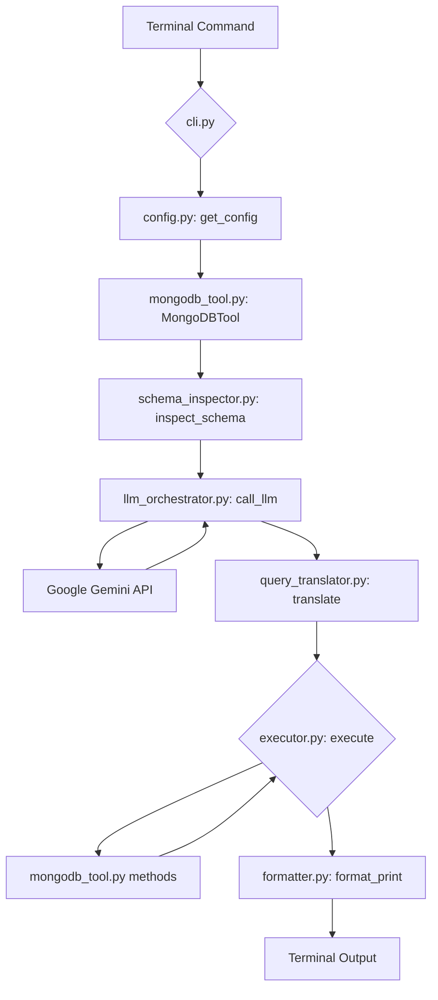

# MongoDB Natural-Language CLI

A command-line tool for interacting with MongoDB databases using natural language queries, powered by Google's Gemini API.

## Features

- Query MongoDB databases using natural language
- Support for common MongoDB operations:
  - Collection management (list, create, drop)
  - Index management (list, create, drop)
  - Document operations (insert, find, update, delete)
- Automatic schema inspection to provide context to the LLM
- Interactive confirmation for destructive operations
- Pretty-formatted outputs for better readability

## Installation

### Requirements

- Python 3.11 or higher
- MongoDB server access
- Google Gemini API key

### Installation Steps

1. Clone the repository:
   ```
   git clone https://github.com/yourusername/mongo_llm_cli.git
   cd mongo_llm_cli
   ```

2. Create a virtual environment:
   ```
   python -m venv venv
   source venv/bin/activate  # On Windows: venv\Scripts\activate
   ```

3. Install the package:
   ```
   pip install -e .
   ```

4. Set up your environment variables by creating a `.env` file:
   ```
   MONGO_URI=mongodb://<user>:<pass>@localhost:27017
   MONGO_DB_NAME=<your_db>
   GEMINI_API_KEY=<your_key>
   ```

## Usage

### Testing Connection

To test your MongoDB connection:

```
mongo-llm test-connection
```

### Running Queries

To run a natural language query:

```
mongo-llm run "list all collections"
mongo-llm run "show me the first 5 documents in the users collection"
mongo-llm run "create a new collection called orders"
mongo-llm run "find all products with price greater than 100"
```

### Using a Different Configuration File

To use a different configuration file:

```
mongo-llm --config /path/to/your/.env run "your query"
```

## Execution Flow

Here's a breakdown of how the tool processes a natural language query, from entering the command in the terminal to displaying the result:

1.  **Command Entry (`cli.py`)**: When you type a command like `mongo-llm run "your query"` in the terminal, the Click library in `mongo_llm_cli/cli.py` acts as the entry point. The `mongo_llm` group and the `run` command are defined here. Click parses the command and arguments, including the natural language query.

2.  **Configuration Loading (`config.py`)**: The `run` command calls the `get_config` function from `mongo_llm_cli/config.py`. This function is responsible for loading the necessary configuration (MongoDB URI, database name, Gemini API key) from environment variables or the `.env` file.

3.  **MongoDB Tool Initialization (`mongodb_tool.py`)**: An instance of the `MongoDBTool` class from `mongo_llm_cli/mongodb_tool.py` is created using the loaded configuration. This tool provides methods for interacting with the MongoDB database (e.g., listing collections, finding documents).

4.  **Schema Inspection (`schema_inspector.py`)**: The `run` command calls the `inspect_schema` function from `mongo_llm_cli/schema_inspector.py`. This function connects to the database using the `MongoDBTool` and retrieves information about the collections and sample documents. This schema information is crucial context for the LLM.

5.  **LLM Orchestration (`llm_orchestrator.py`)**: The `run` command calls the `call_llm` function from `mongo_llm_cli/llm_orchestrator.py`.
    *   Inside `call_llm`, the `build_tool_schema` function creates a schema describing the available methods in `MongoDBTool`.
    *   The `construct_prompt` function builds a detailed prompt for the LLM, including the user's query, the database schema, and the tool schema.
    *   The function then calls the configured Google Gemini LLM with this prompt.

6.  **Query Translation (`query_translator.py`)**: The response from the LLM (a JSON object specifying the tool and arguments) is passed to the `translate` function in `mongo_llm_cli/query_translator.py`. This function parses the LLM's JSON response into a structured `ParsedQuery` object.

7.  **Execution (`executor.py`)**: The `run` command calls the `execute` function from `mongo_llm_cli/executor.py`. This function takes the `MongoDBTool` instance and the `ParsedQuery` object. It uses `getattr` to find the corresponding method on the `MongoDBTool` based on the `parsed_query.tool` and calls that method with the `parsed_query.args`. For destructive operations, there's a confirmation step handled by `mongo_llm_cli/confirmation.py`.

8.  **Result Formatting and Printing (`formatter.py`)**: The result from the `execute` function is passed to the `format_print` function in `mongo_llm_cli/formatter.py`. This function formats the result for display in the terminal, including handling of `datetime` and `ObjectId` objects for JSON output.

Here is a diagram illustrating this flow:



## Example Queries

Here are some example queries that the tool supports:

- "List all collections in the database"
- "Create a new collection called customers"
- "List all indexes in the users collection"
- "Create a unique index on the email field in the users collection"
- "Find documents in users where age is greater than 30"
- "Update all products and set in_stock to true where quantity > 0"
- "Delete inactive users who haven't logged in for a year"
- "Insert a new product with name 'Keyboard', price 49.99, and category 'Electronics'"

## Development

### Running Tests

To run the tests:

```
pytest
```

### Building the Package

To build the package:

```
pip install build
python -m build
```

## License

This project is licensed under the MIT License - see the LICENSE file for details.

## Acknowledgments

- This project uses Google's Gemini API for natural language understanding
- Built with [Click](https://click.palletsprojects.com/) for CLI interface
- Uses [pymongo](https://pymongo.readthedocs.io/) for MongoDB interactions
